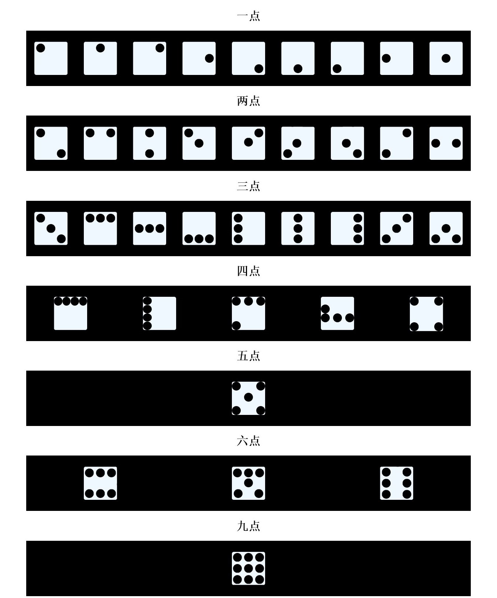

# flex-布局
一个用flex-box布局的小例子
# 容器上的6个属性
* flex-direction：   定义主轴的方向（水平或垂直）
* justify-content:   定义项目在主轴上的摆放位置
* align-items：      定义项目在侧轴上的摆放位置
* flex-wrap：        定义项目在主轴上是否换行及换行的规则
* flex-flow：        是flex-direction和flex-wrap的简写形式
* align-content：    定义了多根轴线的对齐方式。如果项目只有一根轴线，该属性不起作用。
# 项目上的6个属性
* order: 定义项目的排列顺序。数值越小，排列越靠前，默认是0.
* flex-grow: 定义项目的放大比例，默认是0，就是说即使有多余空间，也不放大。
* flex-shrink: 定义项目的缩小比例，默认是1，如果空间不足，该项目会缩小。
* flex-basis: 定义了在分配多余空间之前，项目占据的主轴的空间。
* flex: 是flex-grow, flex-shrink 和 flex-basis的简写，默认值为0 1 auto。
* align-self: 允许单个项目有与其他项目不一样的对齐方式，可覆盖align-items属性。默认值为auto，表示继承父元素的align-items属性，如果没有父元素，则等同于stretch。
### 目前进度(完成) 觉得哪里不好欢迎提Issue哦，若是对你有帮助希望给我颗小星星哦☺

